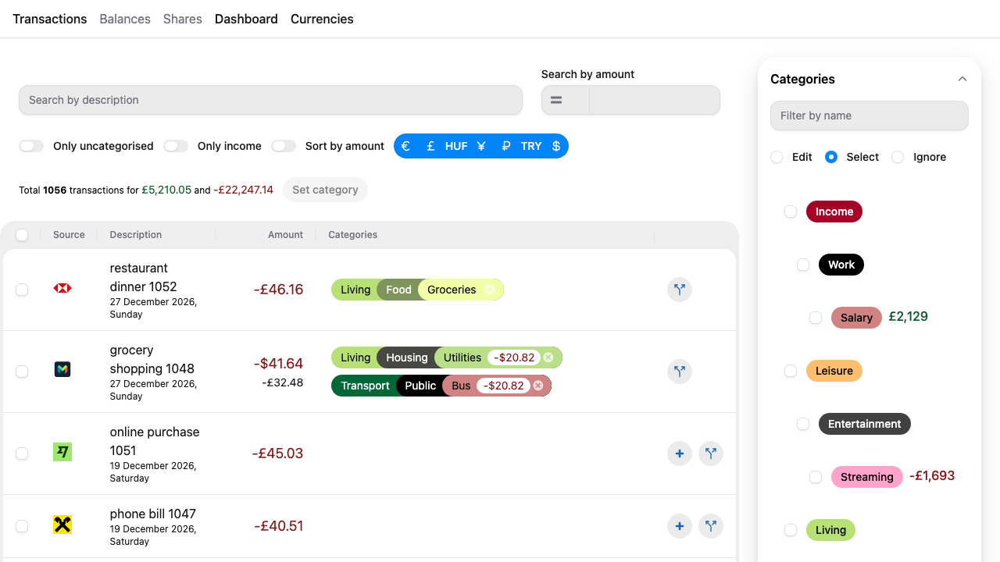
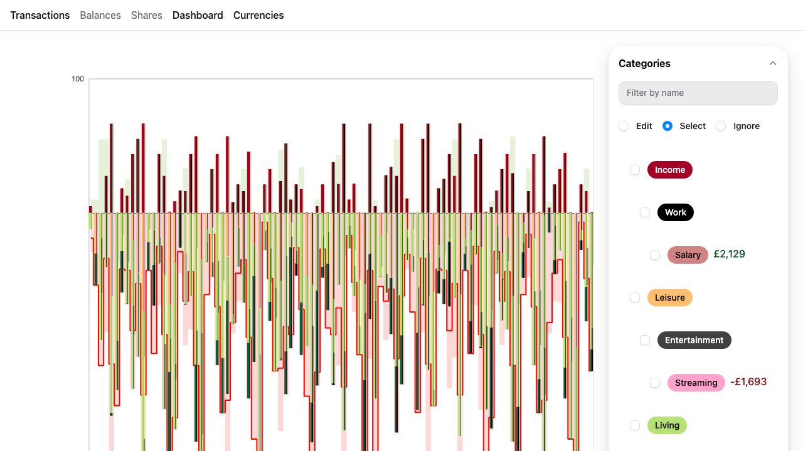
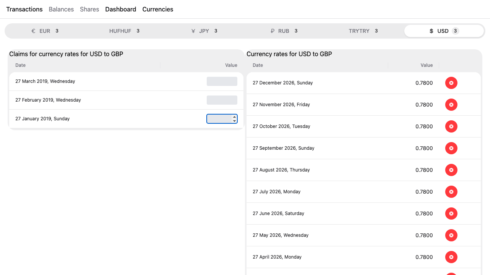
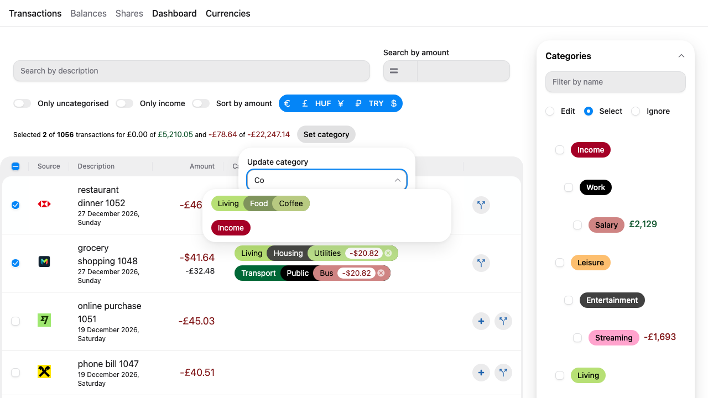
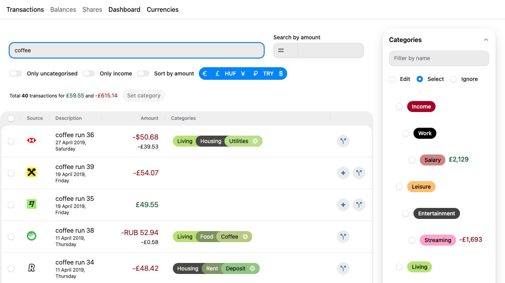
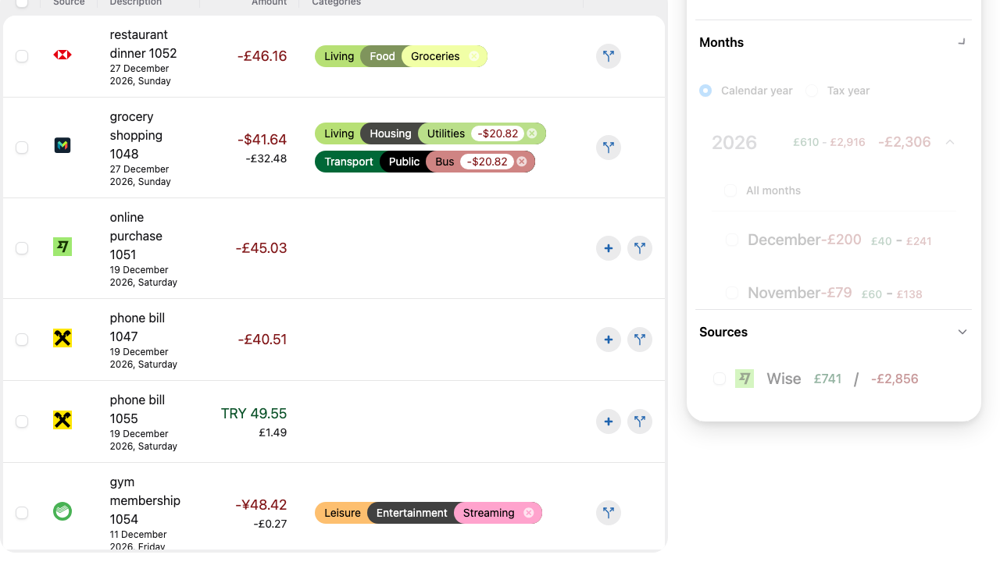
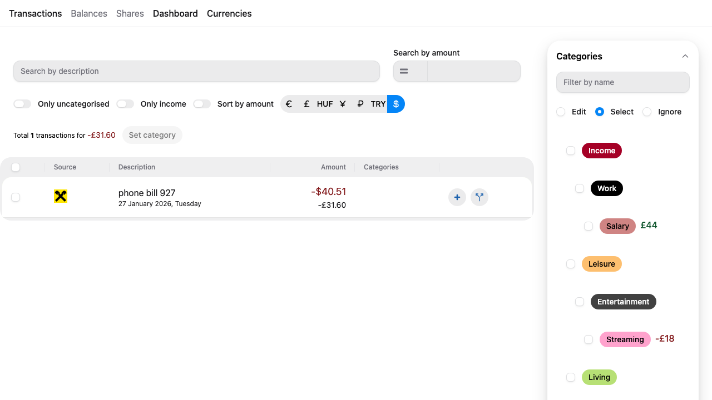
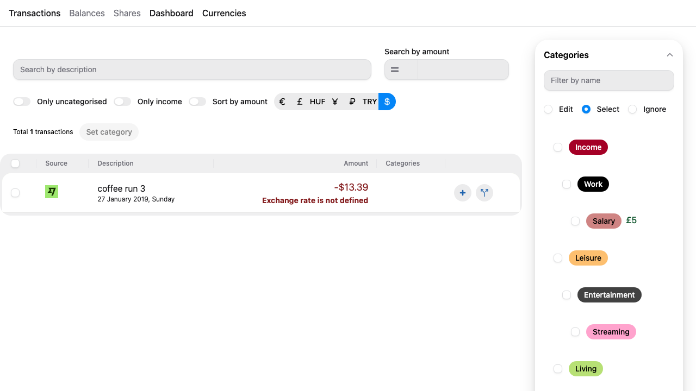
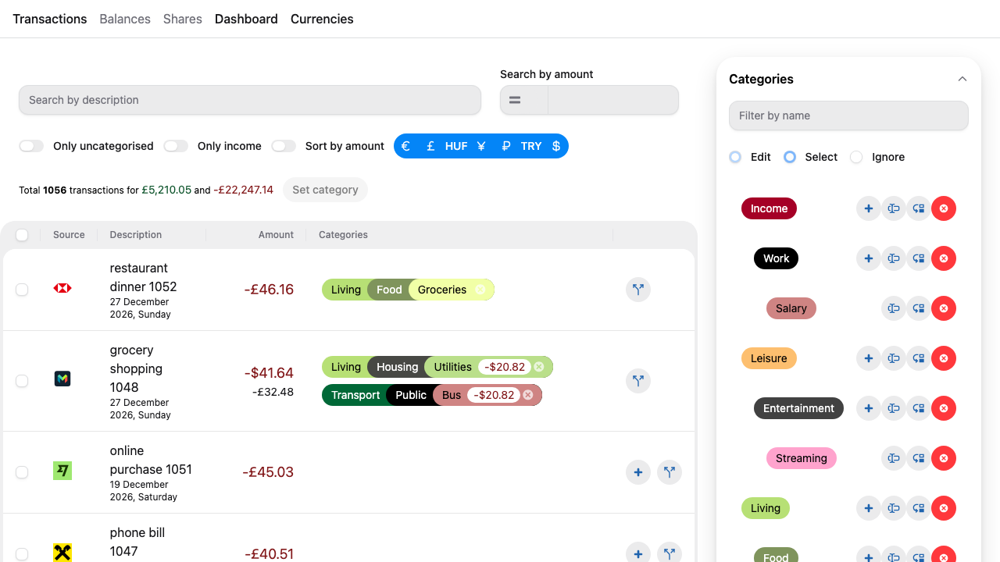

# Budget

A personal, multi-currency budget tracker. Import transactions from eight banks,
organise them into a hierarchical category tree (with per-transaction splits),
convert every foreign-currency transaction to a single base currency (GBP), and
explore your spending through URL-addressable filters and interactive charts.

It is a **single-user, self-hosted** app: a Next.js (App Router) front end talking
to a co-located GraphQL API backed by a local SQLite file.

- **Front end:** Next.js 16 + React 19, HeroUI v3, Tailwind CSS v4, Relay, ECharts.
- **API:** GraphQL Yoga + Pothos schema over Prisma 7 (better-sqlite3 driver adapter).
- **Data:** a single SQLite file plus four SQL views for statistics/claims.
- **Tooling:** CLI importers for bank exports, deterministic Jest unit suite, and a
  real-browser Playwright E2E suite.

---

## Table of contents

- [Screenshots](#screenshots)
- [Features](#features)
  - [Global navigation](#global-navigation)
  - [Transactions](#transactions-page)
  - [Categories](#categories)
  - [Dashboard](#dashboard-page)
  - [Currencies](#currencies-page)
  - [CLI import & currency scripts](#cli-import--currency-scripts)
- [Tech stack](#tech-stack)
- [Architecture](#architecture)
- [Configuration](#configuration)
- [Install & run](#install--run)
- [Testing](#testing)

---

## Screenshots

All screenshots below are captured automatically by
[`tests/e2e/screenshots.spec.ts`](tests/e2e/screenshots.spec.ts) against the
deterministic seed database (~1,056 transactions across 2019–2026), so they always
reflect the current UI.

| Transactions                                                | Dashboard                                    | Currencies                                     |
| ----------------------------------------------------------- | -------------------------------------------- | ---------------------------------------------- |
|  |  |  |

---

## Features

### Global navigation

A shared header appears on every page
([`app/components/Header.tsx`](app/components/Header.tsx)):

- **Active links:** `Transactions`, `Dashboard`, `Currencies`. The current page's
  link carries `aria-current="page"`.
- **Placeholders:** `Balances` and `Shares` are rendered as disabled, non-link
  text (not yet implemented).
- Visiting `/` performs a server redirect to `/transactions`
  ([`next.config.js`](next.config.js)).

Every page loads its data through Relay with `Suspense` + `useDeferredValue`: the
first render shows a spinner, and while a newer query (triggered by a filter
change) is in flight the previous result stays visible at reduced opacity instead
of flashing to a loader.

---

### Transactions page

`/transactions` — the primary workspace. A wide main column (top filters + table)
sits next to a narrow sidebar of accordion filters.


**The table** ([`TransactionsTable.tsx`](app/components/Transactions/TransactionsTable.tsx))

- Columns: selection checkbox, **Source** (bank logo), **Description** (with date),
  **Amount**, **Categories** (colored chips), and a per-row action column.
- **Infinite scroll:** loads `PER_PAGE = 20` rows at a time via Relay's
  `usePaginationFragment`; scrolling the 720px table body fetches the next page.
- **Row styling:** transactions whose categorisation is incomplete are highlighted
  in lime; fully-categorised (completed) rows are white.
- **Empty state:** a restrictive filter shows `No records`.
- **Live refresh:** the table subscribes to a `Transactions` pub/sub channel and
  refetches after any mutation, so category edits appear without a page reload.
- A running **totals bar** shows the filtered transaction count and total
  income/outcome (and switches to "Selected N of M" when rows are selected).

**Selection & bulk categorisation**



- The header checkbox selects/deselects every visible row; selecting a subset puts
  it in the **indeterminate** state.
- With rows selected, the **Set category** button opens an autocomplete popover to
  assign one category to all of them at once.

**Top filters** ([`FiltersTransactions.tsx`](app/components/Filters/FiltersTransactions.tsx)) —
every filter is mirrored to a URL query param, so any filtered view is a shareable,
reload-safe deep link.

| Filter                | URL param                   | Behaviour                                                                                                 |
| --------------------- | --------------------------- | --------------------------------------------------------------------------------------------------------- |
| Search by description | `search`                    | 500 ms debounced. Supports plain substring, negation `!term`, OR `a\|b`, and negated-OR `!a\|b`.          |
| Search by amount      | `amount` + `amountRelation` | Numeric input plus a relation dropdown: equal / greater / less (matches absolute value against ± amount). |
| Only uncategorised    | `onlyUncomplited`           | Toggle; shows only incomplete transactions. _(param name is intentionally misspelled in the app.)_        |
| Only income           | `onlyIncome`                | Toggle; shows only positive amounts.                                                                      |
| Sort by amount        | `sortBy`                    | Toggle; orders by converted amount instead of date.                                                       |
| Currencies            | `currencies`                | Icon button group toggling which currencies are shown.                                                    |



**Sidebar filters** (accordion — Categories / Months / Sources; badges show active
counts):



- **Categories** (`categories` / `ignoreCategories`): a hierarchical checkbox tree
  with three modes — **Select**, **Ignore**, and **Edit** (see
  [Categories](#categories)). Selecting a root also matches its children and
  grandchildren (three levels). A "Filter by name" box narrows the visible tree,
  and active selections appear as removable chips.
- **Months** (`months`): grouped by year with a **Calendar year / Tax year**
  toggle (tax year rolls over after April). Each year has an indeterminate
  "All months" checkbox; months and full years show income/outcome subtotals and
  become removable chips.
- **Sources** (`sources`): a checkbox list of banks, each with its logo and
  income/outcome totals.

**Multi-currency amount display**
([`TransactionAmountCell.tsx`](app/components/Transactions/cell/TransactionAmountCell.tsx))

- GBP rows show a single amount.
- Non-GBP rows show the native amount **and** the converted GBP value.

  

- If a non-GBP transaction has no exchange rate for its date, the cell shows a bold
  red **"Exchange rate is not defined"** warning (and the date/currency becomes a
  _claim_ on the Currencies page).

  

**Per-transaction category actions** (action column):

- **Add** a category to an uncategorised row (autocomplete popover).
- **Split** a transaction's amount across multiple categories with per-split
  editable amounts.
- **Remove** an assigned category chip.

---

### Categories

Categories are hierarchical (self-referencing parent → child), with three levels
surfaced throughout the UI. Each category carries a stable colour used for chips,
bars, and sunburst segments.

Switching the sidebar to **Edit** mode turns the tree into a full CRUD editor
([`FiltersCategories.tsx`](app/components/Filters/FiltersCategories.tsx)):



- **Add** a root category, or **Add subcategory** under an existing one.
- **Edit** a category's name.
- **Move** a category under another parent, or **Move to the root**. The target
  autocomplete excludes the category itself, its current parent, and its
  descendants, keeping the tree within the supported depth.
- **Delete** a category behind a "Yes, remove" confirmation.
- Duplicate names under the same parent are rejected with an inline error.

All category mutations publish a `Categories` pub/sub channel so filters and chips
refetch immediately.

---

### Dashboard page

`/dashboard` — analytics over the same filter state (Categories + Months sidebar;
no transaction-level filters). Built with ECharts
([`DashboardByTimePeriods.tsx`](app/components/Dashboard/DashboardByTimePeriods.tsx)).


- **Time-period chart:** an income area line, an outcome area line, a stepped
  **saldo** (net) line, and **stacked category bars** per month. A data-zoom
  slider scrubs the time range. Category bars use gradient fills that encode their
  place in the hierarchy (root → child → grandchild).
- **Dual sunburst charts:** an income hierarchy and an outcome hierarchy, three
  rings deep, labelled with category name and amount.
- **Click-to-filter:** clicking a category bar toggles that category in the shared
  filter (and therefore the URL), instantly re-scoping the charts.
- Rich React-rendered tooltips show the month plus category / parent / grandparent
  context.

---

### Currencies page

`/currencies` — manage the exchange rates used for conversion
([`Currencies/index.tsx`](app/components/Currencies/index.tsx)).


- A **tab per non-base currency** that has either a defined rate or an outstanding
  claim; a chip shows the number of claims.
- Each tab shows two tables side by side:
  - **Claims** ("Claims for currency rates for X to GBP"): dates/currencies that
    _need_ a rate because a transaction on that date couldn't be converted. Each
    claim row has an input to **enter a rate** on the spot.
  - **Rates** ("Currency rates for X to GBP"): the defined rates, each with a
    **delete** action (confirmation required).
- Both tables paginate with infinite scroll (`PER_PAGE = 20`) and live-refresh via
  a `CurrencyExchangeRates` pub/sub channel. Creating a rate normalises the date and
  stores a deterministic id (`GBP-<target>-<YYYY-MM-DD>`); an invalid value is
  rejected.

---

### CLI import & currency scripts

Transactions are imported from real bank exports via a Commander CLI
([`app/scripts/import.ts`](app/scripts/import.ts)). Amounts are stored as integer
minor units (pennies); on insert, non-GBP transactions get `amount_converted`
computed from the matching exchange rate. Existing rows are never overwritten
(idempotent upsert by id).

| Command                  | Bank                   | Input format           |
| ------------------------ | ---------------------- | ---------------------- |
| `monzo <file>`           | Monzo                  | CSV                    |
| `revolut <file>`         | Revolut                | CSV                    |
| `wise <file>`            | Wise                   | CSV                    |
| `tinkoff <file>`         | Tinkoff                | CSV                    |
| `sberbank <dir>`         | Sberbank               | directory of CSVs      |
| `hsbc <dir>`             | HSBC                   | directory of OFX files |
| `barclays <file>`        | Barclays               | OFX                    |
| `barclays-amazon <file>` | Barclays (Amazon card) | JSON                   |

```bash
pnpm run import -- monzo ./export.csv
```

Exchange rates are managed by [`app/scripts/currencies.ts`](app/scripts/currencies.ts):

```bash
pnpm run currencies -- import-year 2025        # load app/scripts/exchange-rates/2025.csv
pnpm run currencies -- convert-transactions    # recompute amount_converted for non-GBP rows
```

> These scripts parse real, non-deterministic bank data. For tests, use the
> deterministic seed instead (see [Testing](#testing)).

---

## Tech stack

| Layer           | Technology                                                                                                                   |
| --------------- | ---------------------------------------------------------------------------------------------------------------------------- |
| Framework       | **Next.js 16** (App Router, `ssr: false` client pages) + **React 19**                                                        |
| UI              | **HeroUI v3**, **Tailwind CSS v4** (`@tailwindcss/postcss`), **react-icons**                                                 |
| Charts          | **ECharts 6** via `echarts-for-react`                                                                                        |
| Data fetching   | **Relay** (`react-relay`, `relay-nextjs`, `relay-compiler`)                                                                  |
| GraphQL server  | **GraphQL Yoga** + **Pothos** (prisma, relay, errors, simple-objects, prisma-utils plugins)                                  |
| ORM / DB        | **Prisma 7** with `@prisma/adapter-better-sqlite3` over **SQLite**                                                           |
| Language        | **TypeScript**                                                                                                               |
| Parsing         | `csv-parse`, `@hublaw/ofx-parser`, `iconv-lite`, `object-hash`                                                               |
| Tests           | **Jest** + Testing Library (jsdom unit) and **Playwright** (Chromium E2E)                                                    |
| Lint/format     | ESLint (typescript-eslint, perfectionist, import-x, relay, react-hooks) + Prettier (organize-imports, tailwind, prisma, sql) |
| Package manager | **pnpm** (enforced via `preinstall`)                                                                                         |

---

## Architecture

**Request/data flow**

```
SQLite file ──▶ Prisma 7 (better-sqlite3 adapter) ──▶ Pothos GraphQL schema
                                                          │
                                              GraphQL Yoga route  (/graphql)
                                                          │
                                        Relay (client, ssr:false) ──▶ React / HeroUI / ECharts
```

**GraphQL layer** ([`app/graphql/`](app/graphql/))

- `builder.ts` — Pothos `SchemaBuilder` wired to Prisma + Relay + Errors +
  SimpleObjects, plus a custom `Date` scalar.
- `types/` — one file per domain (`transaction.ts`, `category.ts`, `currency.ts`,
  `statistic.ts`) registering queries, mutations, and object types.
- `schema.ts` — imports the type modules and calls `builder.toSchema()`; exported to
  `schema.graphql` (`pnpm run schema`) for the Relay compiler.
- `route.ts` — the App Router handler exposing the Yoga endpoint at `/graphql`.
- `sql/` — raw SQL for four Prisma **views** (see below).

**Client layer** ([`app/components/`](app/components/))

- Relay drives all data fetching; `__generated__/` artifacts are produced by
  `relay-compiler` and must be regenerated after any GraphQL change.
- `FiltersProvider` (React Context + `useReducer`) holds shared filter state for the
  Transactions, Categories, and Dashboard pages and keeps it in sync with the URL
  query string.
- `usePubSub` is a lightweight pub/sub used to refresh lists after mutations.

**Database** ([`schema.prisma`](schema.prisma)) — models `Transaction`, `Category`
(self-referencing), `CurrencyExchangeRate`, and the `TransactionsOnCategories` join
(supports split allocations). Four SQL **views** provide aggregates the app reads
directly and are _not_ created by `prisma db push`; they are applied separately from
[`app/graphql/sql/`](app/graphql/sql/):

- `transactions_statistic` — income/outcome per category per month.
- `transactions_statistic_per_months` — income/outcome per month.
- `transactions_statistic_per_source` — income/outcome per bank.
- `currency_exchange_rate_clames` — dates/currencies needing a rate (claims).

`DateTime` columns are stored as integer epoch-ms, so the Prisma adapter is
configured with `timestampFormat: "unixepoch-ms"`
([`app/lib/prisma.ts`](app/lib/prisma.ts)).

**Directory map**

```
app/
  transactions/  dashboard/  currencies/   # route pages (client, ssr:false)
  components/                              # Transactions, Dashboard, Currencies, Filters, Categories, Header
  graphql/        builder, types/, schema, route, sql/, schema.graphql
  lib/            prisma, relay, types (Source/Currency/PubSub/Sort enums), dates
  scripts/        import.ts + import/<bank>.ts, currencies.ts, serve.ts, schema.ts
schema.prisma      prisma.config.ts   relay.config.js   next.config.js
tests/             components/ graphql/ lib/ pages/ scripts/ (Jest)  +  e2e/ (Playwright)
```

**Key conventions**

- Path alias `@/*` → `app/*`.
- Base currency is **GBP**; every `amount_converted` is in GBP pennies.
- Categories are hierarchical (three visible levels via `parentCategoryId`).
- ESLint enforces `strictCamelCase` variables and `PascalCase` components/enums;
  Prettier organises imports and formats Tailwind/Prisma/SQL.

---

## Configuration

Both variables are **required and have no default** — the app fails fast if either
is unset. Copy `.env.example` to `.env` (inline/shell values win over `.env`):

```bash
cp .env.example .env
```

- `DATABASE_FILE` — `file:` URL to the SQLite database (e.g. `file:./database.sqlite`).
- `PORT` — port the Next.js server listens on (e.g. `3000`).

The `dev`/`start` scripts run through [`app/scripts/serve.ts`](app/scripts/serve.ts),
which loads `.env` before launching Next and errors clearly if a variable is missing.

---

## Install & run

```bash
pnpm install            # postinstall builds better-sqlite3, generates Prisma + schema + Relay
npx prisma generate     # (re)generate the Prisma client
pnpm run schema         # export app/graphql/schema.graphql
pnpm run relay          # run relay-compiler (+ lint)

pnpm run dev            # start the dev server on $PORT
pnpm run build          # production build
pnpm run start          # start the production server on $PORT
pnpm run lint           # tsc --noemit + ESLint
```

Re-run the schema pipeline (`prisma generate` → `pnpm run schema` → `pnpm run relay`)
after changing `schema.prisma` or any GraphQL type.

---

## Testing

Two complementary layers:

### Unit tests (Jest + Testing Library, jsdom)

```bash
pnpm test               # run all unit tests
pnpm test:watch
pnpm test:coverage
```

~99 test files across components, GraphQL types/SQL views, lib helpers, pages, and
the import/currency scripts. Because jsdom can't run the real
HeroUI v3 + react-aria + Relay + ECharts code paths, these tests assert structure
and logic — the browser-level behaviour is covered by the E2E suite below.

### End-to-end tests (Playwright, Chromium)

```bash
pnpm e2e                # run the full suite
pnpm e2e:ui             # interactive UI mode
pnpm e2e:setup          # (re)build the golden seed DB manually
```

The E2E suite runs a **real production build** against an isolated, deterministic
seed database so behaviours like pagination, filtering, currency conversion,
missing-rate warnings, and mutation round-trips are reproducibly covered.

- **Isolation:** a one-time `globalSetup` builds the app and a `golden.sqlite`
  snapshot (`prisma db push` → apply the four SQL views → seed ~1,056 deterministic
  transactions across 2019–2026, a four-level category tree, and exchange rates with
  a deliberate 2019-Q1 rate gap). Each Playwright worker then copies the snapshot and
  runs its **own `next start` server on its own port** against its **own DB copy**,
  so tests run fully in parallel without cross-contamination
  ([`tests/e2e/helpers/server.ts`](tests/e2e/helpers/server.ts)).
- **Mutation specs** reset to a clean snapshot (or a small low-cardinality seed)
  before each test via `resetDb()`.
- **Read-only specs** share the immutable golden snapshot.

**Coverage** (spec files in [`tests/e2e/`](tests/e2e/)): navigation; transactions
table (columns, infinite scroll, row styling, empty state); selection &
indeterminate select-all; top filters (all syntaxes + deep links); sidebar
category/month/source filters; multi-currency amount display & missing-rate warning;
category assignment / split / delete; category-tree CRUD; dashboard chart render,
sidebar filters, and click-to-filter; currency tabs, claims/rates tables, rate
create/delete. [`screenshots.spec.ts`](tests/e2e/screenshots.spec.ts) additionally
captures the images in this README.

**Latest local run:** ✅ **64/64 passed** (Chromium).

> `screenshot: "only-on-failure"` and `trace: "on-first-retry"` are configured in
> [`playwright.config.ts`](playwright.config.ts); failure artifacts land in
> `test-results/` and an HTML report in `playwright-report/`.
